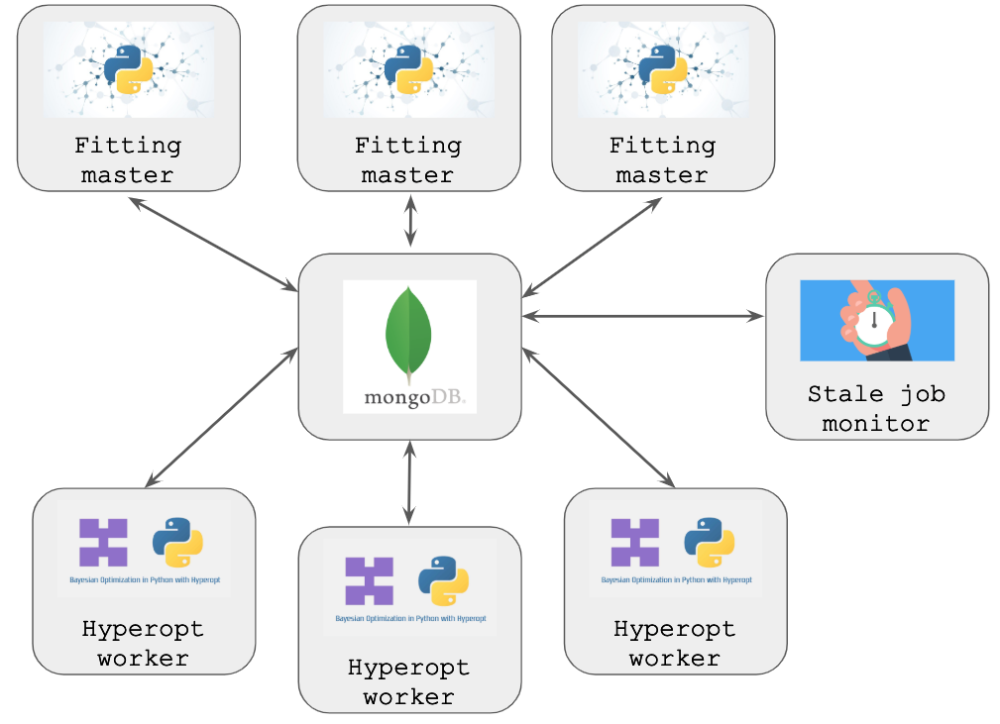

# Hyperkops

This repo contains the components (collectively called Hyperkops) required to execute Baysien optimisaiton experiments within
Kubernetes using the Python library [Hyperopt](https://github.com/hyperopt/hyperopt). 

The hyperkops architecture is comprised of three main components:

* Hyperkops Worker: Hyperopt worker
* Hyperkops Monitor: Identifies and updates hyperopt trials which have run beyond a timeout limit
* MongoDB: MongoDB Instance

Docker images with these components pre-installed can be found here:

An example helm chart can be found here:

Please find a more comprehensive introduction (here****)[LINK TO BLOG]

# Hyerkops Architecture in Kubernetes

[Hyperopt](https://github.com/hyperopt/hyperopt) allows us to parrallise our Bayesian optimisation jobs by distributing 
the experiments across multiple workers, with state stored and shared through a MongoDB instance. If this system is 
operated on a conventional cluster, where the underlying infrastucture is expected to a longer lived than any optimsation
job, if a worker fails through a Python exception the hyperopt-workers emit a shutdown failure message to MongoDB, moving 
all of the worker's current jobs into a failed state, allowing the [Hyperopt](https://github.com/hyperopt/hyperopt) job to complete.

In Kubernetes the instances which execute the hyperopt-workers (Pods) can be significantly shorter lived than some
optimisation jobs and are expected to get rotated on a regular basis. If a pod is deleted whilst the executing an experiment  
the hyperopt-worker will be killed before it can emit an error signal and jobs remain in MongoDB indefinitely in a JOB_RUNNING_STATE. 
We therefore need to introduce an extra component (the pod monitor) which allow us to monitor our deployment, and update 
 relevant MongoDB entries for experiments we know to have been running on failed or deleted pods.   



## Hyperkops Monitor
The Hyperkops Monitor queries the MongoDB instance to find which pods are labelled as currently running experiments, and 
queries the Kubernetes API to compare this list of Pods with  pods in a RUNNING state within the cluster. Any jobs found 
to be logged as running on deleted or failed pods are updated in MongoDB to flag them as in an `Error` state. 

### Installing Hyperkops Monitor
We recommend using the pre-built containers (LINK TO CONTAINERS****). If, however, you would like to install these components
this repository is not yet available in the PyPI repository so installation from github using pip is recommended.

### Starting Hyperkops Monitor

After installation with pip, the Monitor can be started from the command line. The arguments can either be provided within the
command line arguments or they can be inherited from environmental variables. 

|Command Line Argument | Environmental Variable | Description | Default Value| 
| -------------------- |:----------------------:|:-----------:|------------:|
|mongo_db_address | MONGO_DB_ADDRESS | url to MongoDB | localhost | 
|mongo_db_port | MONGO_DB_PORT| mongo db port | 27017| 
|trials_db | TRIALS_DB | Name of the MongoDB in which the trials are stored | model_db| 
|trials_collection | TRIALS_COLLECTION | Name of the Mongo Collection in which the trials are stored | jobs| 
|update_interval |UPDATE_INTERVAL | Time between queries to the MongoDB to find failed jobs | 100| 
|namespace | NAMESPACE | Namespace in which the pods to be monitored are being deployed | | 
|label-selector | LABEL_SELECTOR | Labels which identify relevant hyperkops worker pods | |

Example start command:

```> hyperkops-monitor --mongo_db_address localhost --mongo_db_port 27017 --trials_db model_db --trials_collection jobs```


## Hyperkops Worker
The Hyperkops worker starts a hyperopt-worker thread, inheriting any command line arguments it requires from
suitably named environmental variables. The MongoDB address is set using the specified environmental variables, 
whilst other hyperopt-worker configurations can be set by using the naming convention: 
`HYPEROPT_<COMMAND LINE ARGUMENT NAME IN UPPER CASE>`. Examples are provided below but please refer
 to the hyperopt library itself for a comprehensive list of  [options](https://github.com/hyperopt/hyperopt/blob/master/hyperopt/mongoexp.py). 

| Environmental Variable | Description | Default Value| 
|----------------------|:-----------:|------------:|
| MONGO_DB_ADDRESS | URL to MongoDB | localhost | 
| MONGO_DB_PORT| MongoDB port | 27017| 
| TRIALS_DB | Name of the MongoDB in which the trials are stored | model_db|

Example Hyperopt Worker commands:

| Environmental Variable | Corresponding Hyperopt Command | Description |  
|----------------------|:--------------------------------:|:----------:|
| HYPEROPT_EXP_KEY| --exp-key | Identifier for this worker's jobs | 
| HYPEROPT_LAST_JOB_TIMEOUT| --last-job-timeout | Do not reserve a job after T seconds have passed | 

Example start command:

```> sh ./hyperkops/worker/kube_worker.sh```

## Fitting Master
A fitting master is any Python process which launches a [Hyperopt](https://github.com/hyperopt/hyperopt) 
optimisation job. These can either be launched from your local machine, or from a Pod within Kubenernetes. See 
[LINK TO BLOG***](for more details)

# Example Workload
Provided [here](./examples/optimisation.py) is an example workload which matches that seen in the [Hyperopt Documentation](http://hyperopt.github.io/hyperopt/).
A prebuilt [Docker Container*****](LINK*****) is also provided, along with an example (Kubenetes Manifests****)[./examples/],
 a Helm chart for this infrastructure is also [available***](LINNK****).
 

# Future Work
* UI to allow monitoring of currently running jobs
* Create a high-avaiablilty version of MongoDb
  