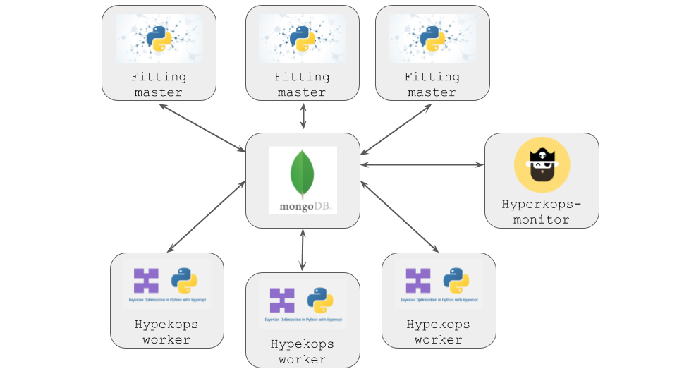

# Hyperkops

This repository provides components which enable a stable infrastructure to be created which allows
the hyperopt library to be exploited in Kubernetes. 

# Architecture in kubernetes

The extra components outlined here are required for deployment of hyperopt in Kubernetes because 
Hyperopt is designed around graceful failure of the worker units. In such a stable system if a worker fails through 
a Python exception it emits a shutdown failure message to MongoDB, and sets all of it current jobs to a failed state. 
In kubernetes, if a pod gets killed (which can happen when a pod gets deleted or rotated to a different underlying 
instance) python won't emit this error signal, and jobs remain in MongoDB indefinitely in a JOB_RUNNING_STATE. 
This monitor helps out Hyperopt by identifying jobs which fit this category of killed jobs, and updates the relevant 
MongoDB record, allowing the optimisation to finish.  



The hyperkops architecture is comprised of three main components:

* Hyperkops Worker: Hyperopt worker
* Hyperkops Monitor: Identifies and updates hyperopt trials which have ran beyond a timeout limit
* MongoDB: MongoDB Instance

Docker images with these components pre-installed can be found here:

An example helm chart can be found here:

# Hyperkops Monitor
The Hyperops monitor looks for jobs which have been longer than a specified time and uUpserts the relevant records
 in MongoDB to flag them as in an `Error` state. 

## Installing Hyperkops Monitor
This repository is not yet available in the PyPI repository so installation from github using pip is recommended.
The library is installed using pip by calling: 

`pip install git+https://github.com/<REPO ADDRESS HERE>`

## Starting Hyperkops Monitor

After installation with pip, the Monitor can be started from the command line. The arguments can either be provided within the
command line arguments or they are inherited from environmental variables. 

|Command Line Argument | Environmental Variable | Description | Default Value| 
| -------------------- |:----------------------:|:-----------:|------------:|
|mongo_db_address | MONGO_DB_ADDRESS | url to MongoDB | localhost | 
|mongo_db_port | MONGO_DB_PORT| mongo db port | 27017| 
|trials_db | TRIALS_DB | Name of the MongoDB in which the trials are stored | model_db| 
|trials_collection | TRIALS_COLLECTION | Name of the Mongo Collection in which the trials are stored | jobs| 
|timeout_interval |TIMEOUT_INTERVAL | Maximum length of time (in seconds) for a job to run before it is considered failed | 1000| 
|update_interval |UPDATE_INTERVAL | Time between queries to the MongoDB to find failed jobs | 100| 

Example start command:
```> hyperkops-monitor --mongo_db_address localhost --mongo_db_port 27017 --trials_db model_db --trials_collection jobs```


# Hyperkops Worker
The Hyperkops worker starts a hyperopt worker thread, inheriting any command line arguments it requires from
suitably named environmental variables. In order to maintain the addressing convention to the MongoDB set out within
other hyperkops components, the MongoDB address is set using the specified environmental variables, whilst other
hyperopt-worker configurations can be set by using the naming convention 
`HYPEROPT_<COMMAND LINE ARGUMENT NAME IN UPPER CASE>`. Examples are provided below but please refer
 to the hyperopt library itself for a comprehensive list of  [options](https://github.com/hyperopt/hyperopt/blob/master/hyperopt/mongoexp.py). 

| Environmental Variable | Description | Default Value| 
|----------------------|:-----------:|------------:|
| MONGO_DB_ADDRESS | url to monogo db | localhost | 
| MONGO_DB_PORT| mongo db port | 27017| 
| TRIALS_DB | Name of the Mongo Database in which the trials are stored | model_db|

Example Hyeropt Worker commands:

| Environmental Variable | Corresponding Hyperopt Command | Description | Default Value| 
|----------------------|:--------------------------------:|:----------:|------------:|
| HYPEROPT_EXP_KEY| --exp-key | identifier for this workers's jobs | None |
| HYPEROPT_LAST_JOB_TIMEOUT| --last-job-timeout | Do not reserve a job after T seconds have passed | None |

Example start command:
```> sh ./hyperkops/worker/kube_worker.sh```


